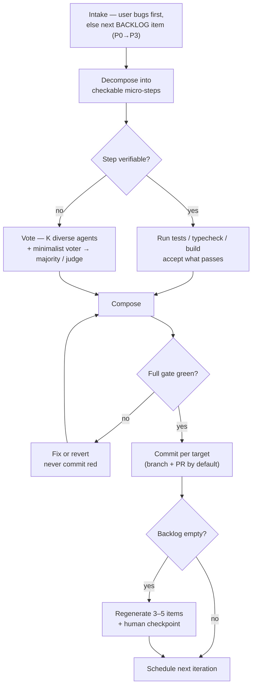

<div align="center">

# rsi-maker-loop

**A perpetual, self-correcting development loop for [Claude Code](https://docs.anthropic.com/en/docs/claude-code).**

Turn a backlog into shipped, verified changes — one reliable micro-step at a time — and let it regenerate its own backlog so it can run indefinitely.

[](LICENSE)


[](https://arxiv.org/abs/2511.09030)

</div>

---

## Why

Autonomous coding loops fail over long horizons because errors **accumulate**.
Every single‑agent step carries a real error rate; chain a few hundred of them
and the process derails. Throwing a bigger model at it only moves the cliff.

`rsi-maker-loop` takes a different route, combining two ideas:

- **RSI loop** — each iteration advances a prioritized `BACKLOG.md`, then
  re‑schedules itself; when the backlog empties it regenerates a fresh batch.
- **MAKER** ([*Solving a Million‑Step LLM Task with Zero Errors*](https://arxiv.org/abs/2511.09030))
  — drive the **per‑step** error rate toward zero by decomposing work into tiny,
  checkable micro‑steps and applying error correction at **every** step.

The software twist that makes it cheap: your **tests, type checker, and build are
the strongest, free "voter."** Multi‑agent voting is reserved for the steps a
machine *can't* check — design, naming, API shape, "is this minimal?"

## One iteration



## Install

Clone (or copy) this repository into your Claude Code skills directory so that
`SKILL.md` lives at `…/skills/rsi-maker-loop/SKILL.md`:

```bash
git clone https://github.com/SandroHub013/rsi-maker-loop \
  ~/.claude/skills/rsi-maker-loop
```

Claude Code discovers the skill by its name; no build step.

## Use

Ask for it in natural language:

> "run an autonomous MAKER loop on this repo"
> "keep working through my backlog on your own"
> "start the RSI loop"

On first run it establishes an operating contract and creates/uses a
`BACKLOG.md`. In perpetual mode it schedules its own next iteration.

## Configure

Optional `.rsi-maker-loop.json` at your repo root (defaults shown):

```json
{
  "commit_target": "branch-pr",
  "vote_k": 3,
  "perpetual": true,
  "max_blast_radius": "small"
}
```

| Key | Meaning |
| --- | --- |
| `commit_target` | `"branch-pr"` (open PRs for review — recommended) or `"main"`. |
| `vote_k` | Independent candidate agents per **unverifiable** step. Verifiable steps use your tests/types as judge and need no ensemble. |
| `perpetual` | Self‑schedule the next iteration. |
| `max_blast_radius` | How much one iteration may change before it must stop and ask — keeps a wrong turn cheap. |

## Design notes

- **Tests are the cheap vote.** Where a deterministic checker exists, the check
  *is* the error correction — generate, verify, accept. No K‑way ensemble.
- **Independence or nothing.** Voting only corrects errors if voters fail
  independently. The skill gives each voter a distinct objective (minimalist /
  robustness / conformance), varies temperature, and mixes model families where
  the host allows. A **minimalist voter is always present** — the structural
  defense against an infinite loop gold‑plating itself into bloat.
- **Small blast radius.** Iterations stay small so a wrong turn is cheap to redo,
  and the full gate (suite + typecheck + build) must be green before any commit.

## Honest boundaries

This skill is deliberate about what it does *not* guarantee:

- **Execution, not direction.** MAKER bounds *execution* errors (is the diff
  correct), not *strategic* drift (is this the right thing to build). There is no
  ground truth for "is the product better," so direction stays a human call: the
  loop pauses for a checkpoint when it regenerates the backlog, and user
  bugs/requests always take priority.
- **Cost scales with `vote_k`.** Reserve ensembles for high‑consequence,
  uncheckable steps; lean on deterministic checks everywhere else.
- **Decomposition has limits.** Excellent for long, mechanical, checkable work;
  weak for genuinely novel architecture that needs holistic design — there the
  skill says so and falls back to a normal, human‑reviewed change instead of
  faking micro‑steps.

## Repository layout

```
rsi-maker-loop/
├─ SKILL.md              # the skill: loop + MAKER protocol + safety/config
├─ references/
│  ├─ voting.md          # per-step decomposition, voting & verification
│  └─ backlog.md         # BACKLOG.md format, priorities, regeneration rule
├─ README.md
└─ LICENSE
```

## Credits

The error‑correction approach is inspired by **MAKER** (Meyerson et al.,
[arXiv:2511.09030](https://arxiv.org/abs/2511.09030)) and its notion of
*massively decomposed agentic processes*. This skill adapts that idea to everyday
software work by treating the repo's own test/type/build gates as the primary
per‑step verifier.

## License

[MIT](LICENSE).
